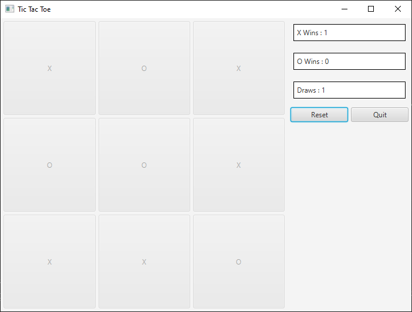

# N✕N Tic Tac Toe (Java)

The program uses [javafx](https://openjfx.io/) library

## Board Variables

- `BOARD_ROWS` - Defines number of rows of the board
- `BOARD_COLS` - Defines number of columns of the board
- `CHECK_ADJACENT_BUTTONS` - Defines number of adjacent buttons to check for the winning

## Features

- Board can be expanded to N rows and N columns.
- Saves winning history
