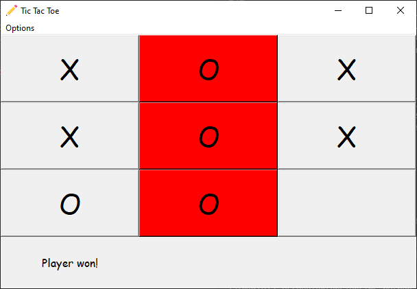

# N✕N Tic Tac Toe (Python)

The program is developed in python 3, and uses [tkinter](https://docs.python.org/3/library/tkinter.html) library. Created a bot using min-max algorithm.

## Board Variables

- `board_size` - Defines number of rows and columns of the board
- `check_adjacent_buttons` - Defines number of adjacent buttons to check for the winning

## Features

- Board can be expanded to N rows and N columns.
- Changes button color on winning.

## Known Issues

- Easy level bot, instead of making the game harder for us the bot makes it more easier.
- Initial steps by computer delays the game.
